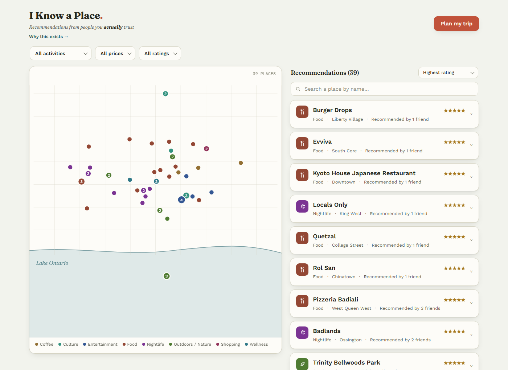

# I Know a Place

Recommendations from people you actually trust — not a scraped review, not an algorithm's guess.

Every place on this site was recommended by someone real, with their own rating and their own words. It's a browsable map + list for exploring Toronto through 56 recommendations from 22 friends, plus a "Plan my trip" tool that builds a real day plan out of them (time / energy / budget in, a few realistic plans out — no AI guessing, no generic itinerary).

**Live site:** _(add your Vercel URL here once deployed)_

## Why this exists

Full story is on the site itself (the "Why this exists" link), but in short: recommendations from friends are usually scattered across texts and group chats, disconnected from how much time or money you actually have. This turns them into something usable.

## Stack

Plain HTML, CSS, and JavaScript — no framework, no build step, no backend. All 39 places and their recommendations are baked directly into the page as data, so the whole thing is one self-contained file that any static host (this one runs on Vercel) can serve as-is.

## Data

Sourced from a Google Form filled out by real friends, cleaned and anonymized (aliases only, no last names). See `/data` if included, or ask the maintainer for the original spreadsheet.

## Status

Prototype — first city is Toronto. Built as a hands-on project to learn AI-assisted ("vibe") coding from the ground up.
